<!-- ========================================================= -->
<!--                         HERO                              -->
<!-- ========================================================= -->

 

  

🇧🇩 **Bangladesh**

  

 

---

<!-- ========================================================= -->
<!--                       ABOUT ME                            -->
<!-- ========================================================= -->

<h2 align="center">👨‍💻 About Me</h2>

  I'm a <b>4th Year Computer Science & Engineering student</b> at
  <a href="http://pstu.ac.bd/"><b>Patuakhali Science and Technology University (PSTU)</b></a>.

  💻 Passionate about <b>Software Engineering, Algorithms & Problem Solving</b> 
  🌱 Currently learning <b>C, C++, Java, Python & Web Development</b> 
  🏆 Practicing Competitive Programming on <b>Codeforces, Beecrowd & HackerRank</b> 
  🚀 Always learning, building and improving.

  <b>🎯 Goal:</b> Become a skilled Software Engineer and build useful software.

---

<!-- ========================================================= -->
<!--                 LANGUAGES & TECHNOLOGIES                  -->
<!-- ========================================================= -->

<h2 align="center">🛠️ Tech Stack</h2>

---

<!-- ========================================================= -->
<!--                    SOCIAL LINKS                           -->
<!-- ========================================================= -->

<h2 align="center">🌐 Connect With Me</h2>

---

<!-- ========================================================= -->
<!--                    GITHUB ANALYTICS                       -->
<!-- ========================================================= -->

<h2 align="center">📊 GitHub Analytics</h2>

  Automatically updated from my GitHub activity.

---

<!-- ========================================================= -->
<!--                       STREAK                              -->
<!-- ========================================================= -->

<h2 align="center">🔥 GitHub Streak</h2>

---

<!-- ========================================================= -->
<!--                  CONTRIBUTION SNAKE                       -->
<!-- ========================================================= -->

<h2 align="center">🐍 Contribution Snake</h2>

<picture>

<source
  media="(prefers-color-scheme: dark)"
  srcset="https://raw.githubusercontent.com/Sakib2405/Sakib2405/output/github-contribution-grid-snake-dark.svg"
/>

<source
  media="(prefers-color-scheme: light)"
  srcset="https://raw.githubusercontent.com/Sakib2405/Sakib2405/output/github-contribution-grid-snake.svg"
/>

</picture>

---

<!-- ========================================================= -->
<!--                         PROFILE                           -->
<!-- ========================================================= -->

---

<!-- ========================================================= -->
<!--                         FOOTER                            -->
<!-- ========================================================= -->

<h3>✨ Thanks for visiting my profile!</h3>

  <b>⭐ Learn • Build • Solve • Grow 🚀</b>

  

Made with ❤️ by Nazmus Sakib

